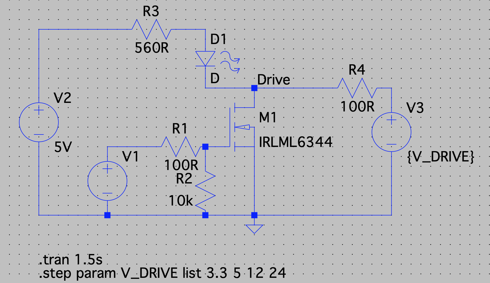
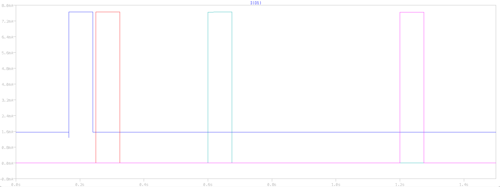

# MOSFET with different LED and Load Drive Voltages

This is pretty simple, but wanted to ensure there wouldn't be a weird short if the indicator LED is driven from 5V and the load from 24V or some other higher reference.  

We want to always drive the LED from 5V, since we can then better control the current (and therefore brightness) through the LED, but want selectable voltages for the outputs.

The one caveat to this arrangement is that the load's driving reference MUST be higher than 5V, or there will be a leakage current all the time.  It's pretty low, but could be a problem all the same. On potential fix is to use the 3.3v tap for the thermistors to then drive the LED's, which lowers this threshold even more.

## Schematic

This is the basic schematic implemented for each MOSFET output, including variable voltage drives.

## Simulation Results

For varying input Voltages (increase voltage over time, each spike is one drive voltage), we see that there is only a leakage current when V3 < V2.  Thus, as long as we use 5V or higher, we should be fine.  Especially since most 5V loads can be driven directly from the SKR board supply, V2 and V3 will be the exact same since they share the bus.  This does limit us every so slightly in terms of external 5V supplies and other low voltage drive circuits, but if you need to really configure it, just remove the LED.

Voltage inputs were 3.3V, 5V, 12V, and 24V, common supply voltages for 3D printers still under the 30V max voltage of the MOSFETs.
