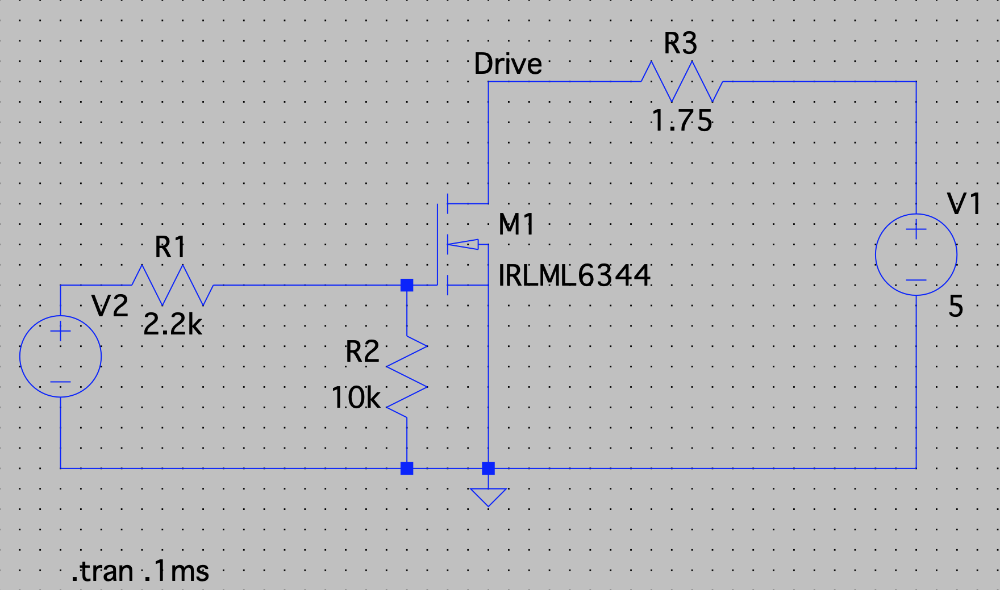
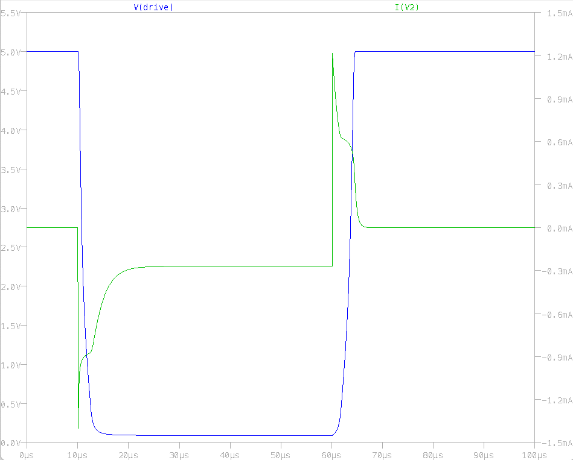

# I/O Characteristics

The STM32 data sheet warns:

> PC13, PC14 and PC15 are supplied through the power switch. Since the switch only sinks a limited amount of current (3 mA), the use of GPIOs PC13 to PC15 in output mode is limited:
>
> - The speed should not exceed 2 MHz with a maximum load of 30 pF
> - These GPIOs must not be used as current sources (for example to drive a LED).

Therefore, if we want to use the BL Touch port (Probe pin is on PC14) as an output, we need to make sure we don't violate the above rule.

Since we're running a Mosfet, the steady state current is easy to calculate, and easy to keep under the guideline.  However, there can be transients when turning on transistors, so we need to be aware of that.  This folder is an LTspice simulation with the IRLML6344 (FET on the Klipper Expander, spec part for this one too).

The base configuration has R1 being around 100 ohms, but that causes a ~26mA spike when turning on or off the transistor.  However, if we increase the value, we can lower that transient.

Thus, we can see that we are at a current spike of 1.5mA, which is below the threshold by FOS = 2.  We still get decently fast switching times, (1us FET rise time on 100R to  5us on 2.2k), but protect the STM32 much better.

Since we are then slightly limited by the rise time, that 5us rise time gives us a max frequency of 200kHz at 50% duty cycle.  This probably beyond what is needed for most fans, and can be easily reconfigured in Klipper.