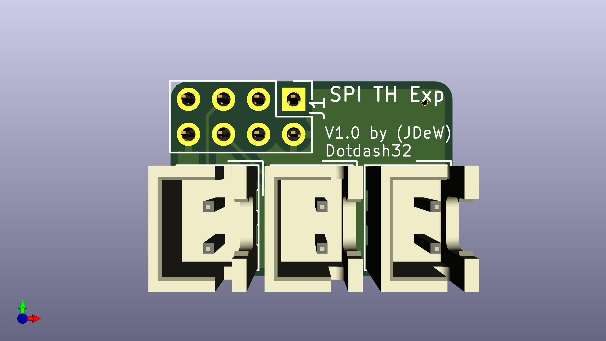

# Thermistor Expander

This PCB is probably not supremely useful, but it has a special place in my heart.

Here are some pretty pictures of what it looks like!

## Images

### Bill of Materials

These are preliminary components, and have NOT been fully tested.

|Designators | Component Name | Description | DK Link|
|---|---|---|---|
|C1, C2, C3 | 10uF Capacitor | 2.5mm lead spacing Ceramic Capacitor |[FG14X7R1A106KRT06](https://www.digikey.com/en/products/detail/tdk-corporation/FG14X7R1A106KRT06/5811737) |
|J1 | 2x4 Pin Header | Female 2.54mm spacing header |[PPTC042LFBN-RC](https://www.digikey.com/en/products/detail/sullins-connector-solutions/PPTC042LFBN-RC/810211) |
|J2, J3, J4 | JST-XH-B2B | JST XH 2 Pin header, to thermistor |[B2B-XH-AM](https://www.digikey.com/en/products/detail/jst-sales-america-inc/B2B-XH-AM-LF-SN/1016630) |
|JP1 | Jumper | V2/V3 Pin Selector | none|
