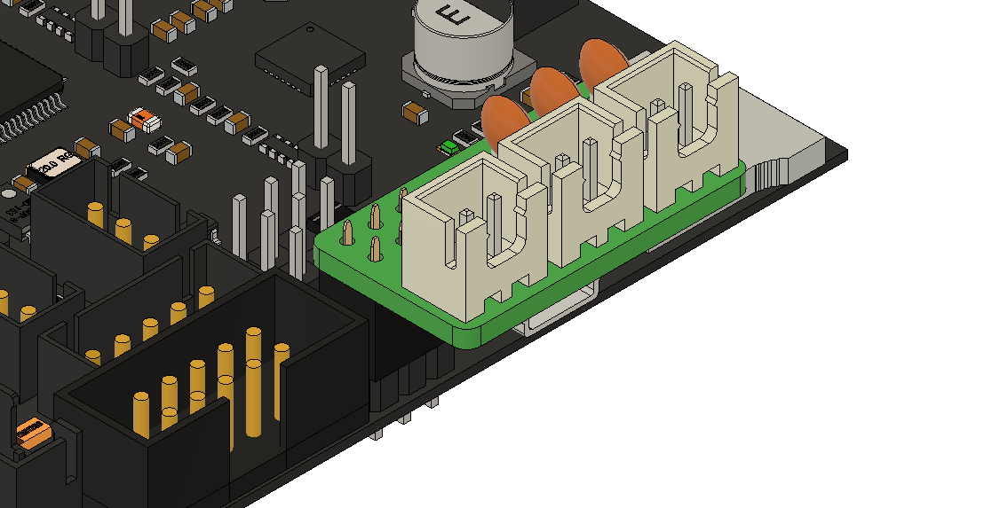

# SKR E3 Mini V2.0 Expanders

A set of simple expander PCBs to give more thermistor and MOSFET fan outputs.

## Fan Expander

Uses the BL Touch port to add 2 fan outputs that natively run at 5v (V0 hotend fan) with optional switch to +12/24v.

## Thermistor Expander

Uses SPI1 interface to add up to 3 thermistors.

Be aware, they use 10k pull ups (next to SD-card on SKR board), which are different than the typical 4.7k pull ups.  This changes the thermistor sensitivity, so be aware they might not be as sensitive at printing temperatures.  This is based on Timmit's Umbilical mod, and the thermistor ports are designed for chamber and other low temperature and non-sensitive applications.

Uses entirely THT components for easier hand soldering.  The one pseudo exception is the TH4 switch, which handles switching between pins on the SKR Mini E3 V2 and V3. But that just needs a simple solder bridge.

### Thermistor Expander BOM

These are preliminary components, and have NOT been fully tested.

|Designators | Component Name | Description | DK Link|
|---|---|---|---|
|C1, C2, C3 | 10uF Capacitor | 2.5mm lead spacing Ceramic Capacitor |[FG14X7R1A106KRT06](https://www.digikey.com/en/products/detail/tdk-corporation/FG14X7R1A106KRT06/5811737) |
|J1 | 2x3 Pin Header | Female 2.54mm spacing header |[PPTC032LFBN-RC](https://www.digikey.com/en/products/detail/sullins-connector-solutions/PPTC032LFBN-RC/810210) |
|J2, J3, J4 | JST-XH-B2B | JST XH 2 Pin header, to thermistor |[B2B-XH-AM](https://www.digikey.com/en/products/detail/jst-sales-america-inc/B2B-XH-AM-LF-SN/1016630) |
|JP1 | Jumper | V2/V3 Pin Selector | none|
