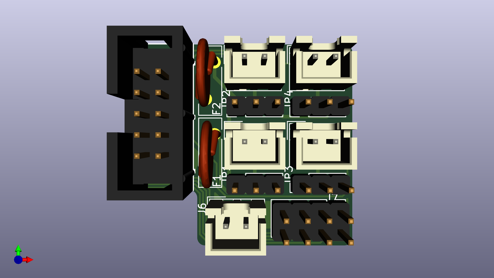

# SKR E3 Mini V2.0 Expanders

A set of simple expander PCBs to give more thermistor and MOSFET fan outputs.

## Fan Expander

All fans have a 2 way voltage select header, and by moving a jumper between 5V and 24V (keeping the center Fx pin common), the drive voltage of the fan can easily be chosen.  If another voltage is desired for an individual fan, a jumper wire can also be tied directly into the Fx (center pin), providing any voltage higher than 5v.  All fans are broken out through JST-XH connectors.

All fans are also equipped with an indicator LED.  This LED is always driven from the 5V supply (EXP or external 5V supply pins) to ensure consistent brightness.  If you don't want the indicator LEDs, the jumper LED_EN can be cut to disable their power rail.  In a similar vein, if any fan is to be powered by less than 5V, the LED **must** be disabled at least for that fan, but is simplest to disable for the entire board by desoldering LED_EN.  

To keep all SMD components on one side (for manufacturing considerations), the LEDs shine through the board and into the connectors themselves.  This limits LED color options, but keeps the overall complexity and board size low.

### Fan Expander (Big Beefy Boi)

The "beefy boi" version of the Fan Expander uses either the EXP1 or EXP2 headers to drive up to 7 new fans and switch the voltage of one passthrough fan.  It can work next to a Thermistor Expander, or be mounted elsewhere and connected with a ribbon cable.

There are several "modes" of operation, mainly concerning voltage sources.  5V supply can come from the EXP header (EXP1 only), the 2 pin 5V header, or screw terminals.  24V (or other high voltage supply) can come from Fan0 In (passthrough fan) or the screw terminals.  Both supply lines are fused with ATM fuses, 3A standard, 10A optional.  See the [Operational_Modes.md](Operational_Modes.md) for detailed operation.

In general, JST-XH connectors are rated for 3A, and the BOM jumpers are specified to meet that current rating for each individual fan.  However, if using the Fan0 In connector, this limits the total current rating of the board.  Consider using the screw terminals for larger loads!

### Fan Expander Lite

The "Lite" version of the Fan Expander uses the EXP1 Header to drive 3 new fans and change the drive voltage for Fan1.  It is designed to be used next to the Thermistor Expander.  It is designed specifically for an SKR E3 in a Voron V0 (no external display, no SD card used).

Designed as a simpler, drop in solution than the fully featured Beefy Boi, it only has the LED_EN jumper and no others.  5V is supplied through EXP1, and 24V (or printer bus voltage) through Fan1 In connector.  Since it only uses 3 of 7 available I/O lines, so the remaining 4 lines are broken out to J7 IO Passthrough, next to a ground line each.

## Thermistor Expander

Uses SPI1 interface to add up to 3 thermistors on E3 based boards when an SD card is not needed.

Be aware, the SPI pins use 10k pull ups (next to SD-card on SKR board), which are different than the typical 4.7k pull ups.  This changes the thermistor sensitivity, so be aware they might not be as sensitive at printing temperatures.  This is based on Timmit's Umbilical mod, and the thermistor ports are designed for chamber and other low temperature and non-sensitive applications.

The TH4 Solder jumper switches the SPI pins that have been rearranged (V2.0 versus V3.0), and this solder jumper allows either SKR Mini E3 board to support 3 thermistors. All the pins are rearranged, so please see software configuration/schematic PDF for the correct pins for your board.

Klipper may try to read the SD card (which will fail, adding an RC circuit will destroy SPI timing requirements) during boot up if the thermistor pins are not declared as analog inputs, overriding their original SPI purpose.  Thus, please include the Thermistor Expander configuration before plugging the PCB in.  If your SKR refuses to boot, please unplug the Thermistor Expander PCB, boot up normally, then add the configuration file.

Requires 3 0805 SMD capacitors on the reverse side, which easier to source than THT variants (chip shortage, whoo), but are large enough to be relatively easy to hand solder.

## Bill of Materials

The BOM is shared between all sub-boards to make bulk ordering easier.

See the [Google Sheet](https://docs.google.com/spreadsheets/d/1q3EhH6Y6PAZSyFnE2HCBAoWyKbX_h1eaZGjsf7-CNqc/edit?usp=sharing).  Included is a "Composite Orderer" to allow a group order of all 3 sub assemblies to be ordered as one, as well as detailed BOMs for each.  This includes DigiKey alternatives to LCSC part numbers.

Each sub-project also has a csv file of it's specific BOM ready for import to LCSC included in this repository.  In each, JST-crimp connectors are also included, but can be excluded (since the larger wire gauge ones are sometimes difficult to source).  This saves some cost, but it's relatively small in the grand scheme of things.

## Errata

See the [Errata](Errata.md) for production issues and fixes.  While unfortunate, they must be documented.
