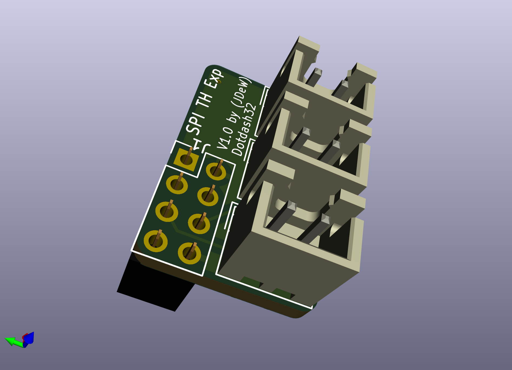

# SKR E3 Mini V2.0 Expanders

A set of simple expander PCBs to give more thermistor and MOSFET fan outputs.

## Fan Expander

### Fan Expander Lite

The "Lite" version of the Fan Expander uses the EXP1 Header to drive 3 new fans and change the drive voltage for Fan1.  It is designed to be used next to the Thermistor Expander

It uses EXP1 for the 3 new FET control lines and exposes the four unused GPIO lines and puts them next to a Ground pin.  5V and ground are pulled through the EXP1 header (5V fused at 1A); 24V is pulled from the FAN1_IN port (24V fused at 3A).  Fan1's low side drive signal is then passed through to the Fan1 out port, with a voltage select header choosing which high side voltage is used.

All fans have a 2 way voltage select header, and by moving a jumper between 5V and 24V (keeping the center Fx pin common), the drive voltage of the fan can easily be chosen.  If another voltage is desired for an individual fan, a jumper wire can also be tied directly into the Fx (center pin), providing any voltage higher than 3.3v.

All fans are also equipped with an indicator LED.  This LED is always driven from the 5V supply from EXP1 to ensure consistent brightness.  If you don't want the indicator LEDs, the jumper JP5 can be cut to disable their power rail.  In a similar vein, if any fan is to be powered by less than 5V, the LED **must** be disabled at least for that fan, but is simplest to disable for the entire board by cutting JP5.

## Thermistor Expander

Uses SPI1 interface to add up to 3 thermistors.

Be aware, they use 10k pull ups (next to SD-card on SKR board), which are different than the typical 4.7k pull ups.  This changes the thermistor sensitivity, so be aware they might not be as sensitive at printing temperatures.  This is based on Timmit's Umbilical mod, and the thermistor ports are designed for chamber and other low temperature and non-sensitive applications.

The TH4 Solder jumper switches the SPI pins that have been rearranged (V2.0 versus V3.0), and this solder jumper allows either SKR Mini E3 board to support 3 thermistors. All the pins are rearranged, so please see software configuration/schematic PDF for the correct pins for your board.

Requires 3 1206 SMD capacitors on the reverse side, but is otherwise THT.  The 1206 capacitors are easier to source (chip shortage, whoo), but are large enough to be relatively easy to hand solder.

## Bill of Materials

The BOM is shared between all sub-boards to make bulk ordering easier.

See the [Google Sheet](https://docs.google.com/spreadsheets/d/1q3EhH6Y6PAZSyFnE2HCBAoWyKbX_h1eaZGjsf7-CNqc/edit?usp=sharing).

Coming soon: interactive ordering tool, enter how many of each board you want components for, and it'll generate a total LCSC list.
