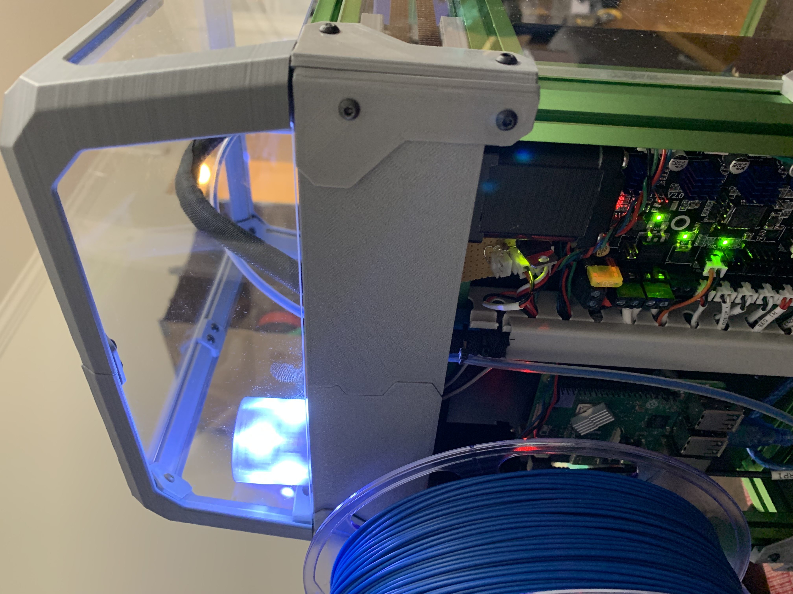
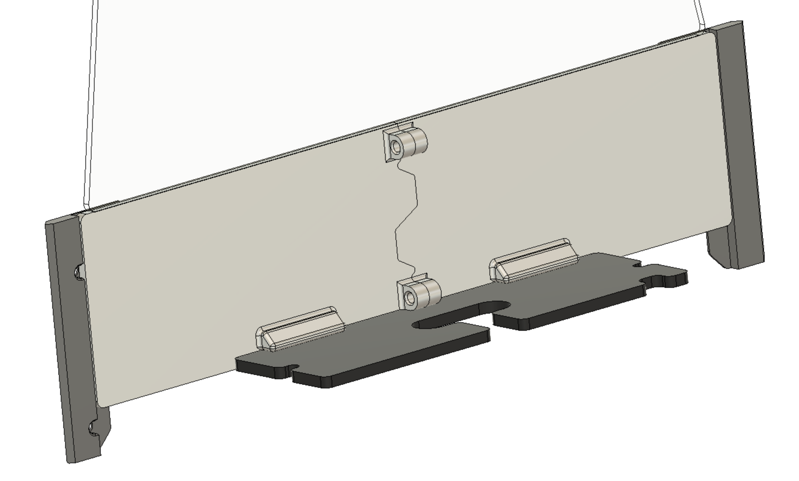

# V0 Small Back Panel

A little tiny 3D printable back panel to enclose the printing area of the V0 while leaving the electronics bay fully accessible.

I came up with this while doing a bunch of electronics modifications, but also needing to use my printer.  Rather than needing to continuously remove and re-insert the full length back panel, this is a small panel that sits just at the top, enclosing the mid-panel up to the top hat, but leaves the electronics fully open.

It also helps a lot with electronics temperatures, was getting around 70C on the Pi without cooling with the full back panel, maxing out around 47-50C now.

## An Open Back
 

While not a fashionable dress, it leaves the rear of the machine open to air, great for keeping everything cool, or seducing people with your amazing wiring (not my machine though :\\)

Two little lips keep the bottom of the panel well aligned, and two self-tapping M3 holes securely join the pieces together.  Because of this cut, both pieces fit on a V0 buildplate at the same time (~1:30 hr print time) and screw together simply.

Since most panels come as a set, the lip that extends down past the motor panel scales with the inputted thickness, rather than aligning to the bottoms of the panel clips.  This should give just a little more access to the cable chain to the hotend, or umbillical PCB if you're using it.

## Materials

* 1x `X_Xmm_Left_Panel.stl`
* 1x `X_Xmm_Right_Panel.stl`
* 2x M3x8 bolts, SHCS or BHCS

Measure your back panel thickness, and use the corresponding STLs.  They all use the same screws, and button head or socket head will work fine.  I found socket heads easier to use with ball drivers (the angle isn't the nicest thing ever).
