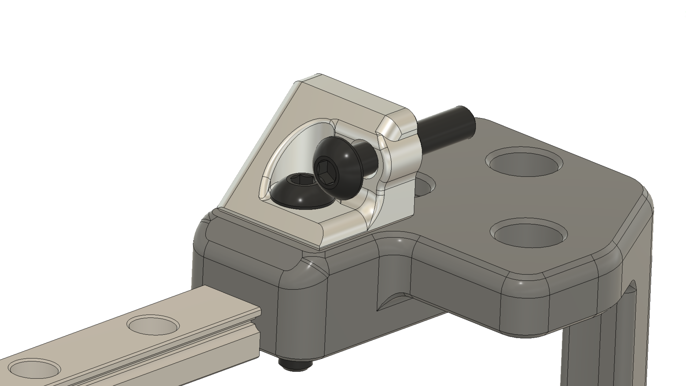
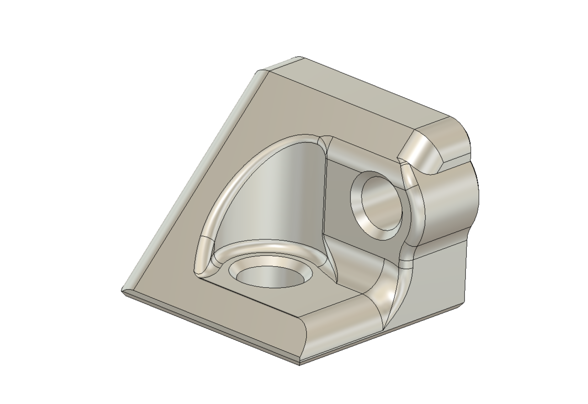

# V0 X-Endstop Bumper

## Overview

A bumper to allow access to the XY joint screw without needing to remove the X Endstop triggering screw.

A drop in replacement for the existing `[a]_X_Endstop_Bumper_x1`, it moves the adjustable microswitch triggering bolt slightly in +Y and +Z directions, increasing clearance around the XY joint bolt.
This allows the adjustable screw to be started (self tapped into the plastic part) off the machine, which aids assembly.  Also, it gives full access to adjust the XY joint if the gantry needs to be de-racked.

## Status

Currently in testing!  
The part is pretty simple, and a near exact copy save for the moved screw hole and modified ribs, but it still needs stress testing.

## Visuals

Assembly context: Mounts in the exact same place as the old part.

Main differences: new hole location, removed right side rib.  Slight bulge on the side of the part to keep a good thickness clearance around the self-tapped hole.

